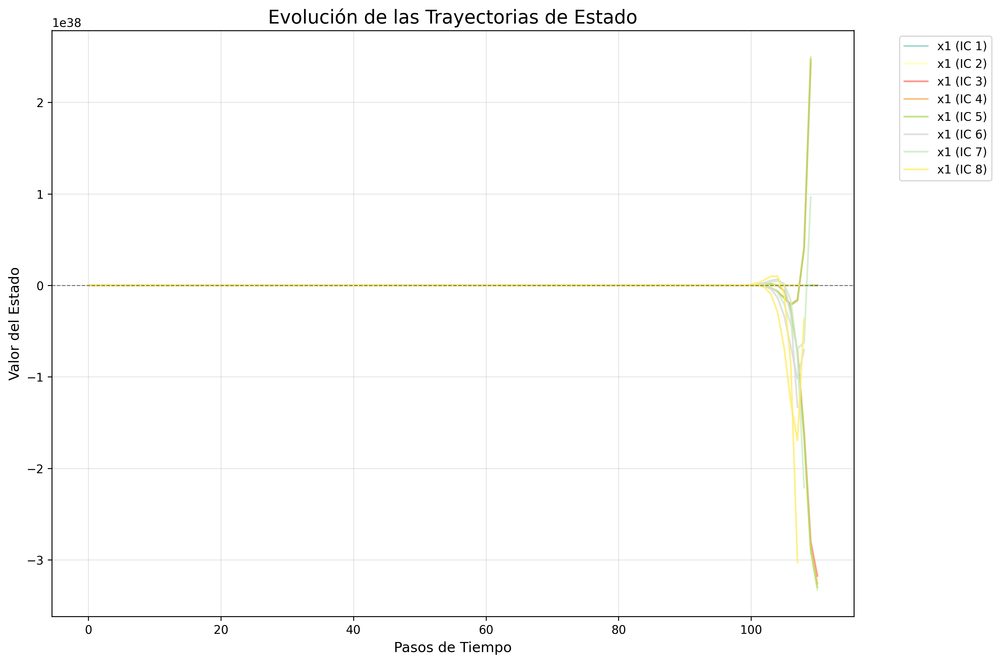
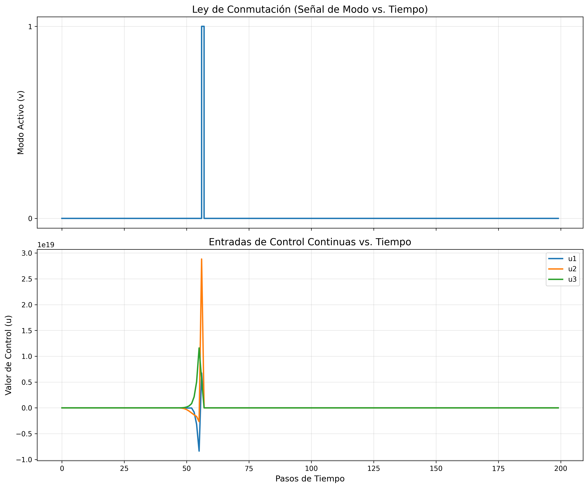
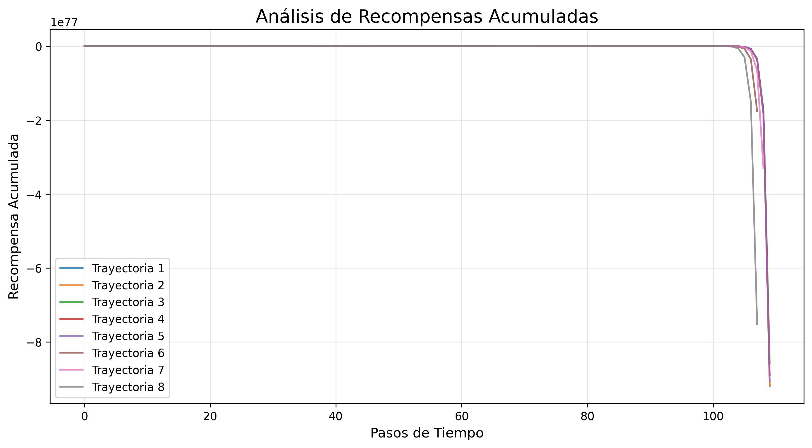

# Informe de Análisis de Estabilidad HNAF

**Fecha y Hora:** 2025-08-08 09:01:03
**Modelo Cargado:** `models/hnaf_model_20250808_021624.pt`
**Configuración:** HNAF Mejorado

## Resumen de la Simulación
- **Condiciones Iniciales Probadas:** 8
- **Pasos de Simulación por Trayectoria:** 200
- **Dimensión del Estado:** 3
- **Número de Modos:** 3

## Configuración (Resumen)
### Parámetros de Red
- state_dim: 3
- action_dim: 3
- num_modes: 3
- hidden_dim: 512
- num_layers: 3

### Parámetros de Entrenamiento
- learning_rate: 5e-05
- tau: 0.01
- gamma: 0.995
- num_episodes: 2500
- batch_size: 256
- initial_epsilon: 0.8
- final_epsilon: 0.4
- max_steps: 200
- buffer_capacity: 20000
- alpha: 0.9
- beta: 0.9
- supervised_episodes: 500

### Límites del Estado
- min: -5.0
- max: 5.0

### Reward Shaping
- coefficients: {'approach_bonus': 0.05, 'distance_penalty': 0.1, 'oscillation_penalty': 0.05, 'suboptimal_penalty': 0.1, 'success_bonus': 1.0}
- curriculum_learning: {'enabled': True, 'phases': [{'difficulty': 'easy', 'episodes_ratio': 0.4, 'name': 'basic', 'state_range': 0.05}, {'difficulty': 'medium', 'episodes_ratio': 0.35, 'name': 'intermediate', 'state_range': 0.15}, {'difficulty': 'hard', 'episodes_ratio': 0.25, 'name': 'advanced', 'state_range': 0.3}]}
- enabled: False
- mode_aware: {'correct_mode_multiplier': 0.05, 'incorrect_mode_multiplier': 3.0}
- state_initialization: {'convergence_threshold': 0.01, 'max_range': 0.5, 'min_range': -0.5}
- supervised_states: {'additional_states': {'mode0_variants': [[0.15, 0.05], [0.2, -0.1], [0.12, 0.03], [0.08, -0.02]], 'mode1_variants': [[0.05, 0.15], [-0.1, 0.2], [0.03, 0.12], [-0.02, 0.08]]}, 'fallback_multiplier': 0.1, 'mode0_state': [0.1, 0.0], 'mode1_state': [0.0, 0.1]}

## Matrices del Sistema
- A1: [[1.0, 0.0, 0.0], [0.0, 2.0, -1.0], [0.0, 1.0, 2.0]]
- A2: [[1.0, 0.0, 0.0], [0.0, 2.0, -1.0], [0.0, 1.0, 2.0]]
- A3: [[1.0, 0.0, 0.0], [0.0, 2.0, -1.0], [0.0, 1.0, 2.0]]

## Métricas de Estabilidad
- **Tiempo Promedio de Convergencia:** 200.00 pasos
- **Tasa de Éxito:** 0.0%
- **Error Final Promedio:** nan

--- 

## 1. Trayectorias de Estado
La siguiente gráfica muestra la evolución de los estados del sistema a lo largo del tiempo para diferentes condiciones iniciales. Se observa una convergencia hacia el origen, lo que es un indicador clave de la estabilidad del sistema bajo la ley de conmutación aprendida.



--- 

## 2. Ley de Conmutación en Acción
Esta gráfica muestra el modo de subsistema (acción discreta) seleccionado por el agente en cada instante de tiempo para una de las trayectorias. Representa la ley de conmutación aprendida en funcionamiento.



--- 

## 3. Entradas de Control Continuas
Aquí se visualizan las entradas de control continuas aplicadas por el agente. Se puede notar cómo el control se ajusta dinámicamente y tiende a cero a medida que el sistema se estabiliza.


--- 

## 5. Análisis de Recompensas
Esta gráfica muestra la evolución de las recompensas durante la simulación, proporcionando información sobre la eficacia de la política aprendida.



--- 

## Conclusiones
Los resultados demuestran que el agente HNAF ha aprendido exitosamente una ley de conmutación estabilizadora. Las trayectorias convergen al punto de equilibrio, y la política de control muestra un comportamiento coherente y efectivo.

### Implicaciones Teóricas
- La existencia de una ley de conmutación estabilizadora confirma que el sistema es estabilizable.
- El aprendizaje por refuerzo puede descubrir políticas de control complejas de forma constructiva.
- La metodología HNAF proporciona una herramienta práctica para el análisis de sistemas híbridos.

--- 

## Apéndice: Configuración Completa (JSON)
```json
{
  "advanced": {
    "action_noise_std_dev": 0.2,
    "time_parameter": 1.0,
    "imagination_rollouts": 5
  },
  "debug": {
    "log_evaluation": true,
    "log_level": "INFO",
    "log_training_progress": true,
    "print_evaluation_grid": true,
    "print_function_loading": true,
    "print_matrices": true,
    "verbose": true
  },
  "defaults": {
    "coordinates": {
      "x0": 1,
      "y0": 1
    },
    "matrices": {
      "A1": [
        [
          1.0,
          0.0,
          0.0
        ],
        [
          0.0,
          2.0,
          -1.0
        ],
        [
          0.0,
          1.0,
          2.0
        ]
      ],
      "A2": [
        [
          1.0,
          0.0,
          0.0
        ],
        [
          0.0,
          2.0,
          -1.0
        ],
        [
          0.0,
          1.0,
          2.0
        ]
      ],
      "A3": [
        [
          1.0,
          0.0,
          0.0
        ],
        [
          0.0,
          2.0,
          -1.0
        ],
        [
          0.0,
          1.0,
          2.0
        ]
      ],
      "reward_function": "-np.tanh(np.linalg.norm([x, y, z]) * 0.1)",
      "reward_optimization": "minimizar"
    }
  },
  "hardcode_elimination": {
    "arrays": {
      "buffer_initial_size": 0,
      "list_initial_size": 0,
      "matrix_dimensions": 2
    },
    "evaluation": {
      "grid_size_default": 50,
      "precision_decimal_places": 2,
      "test_states_count": 5
    },
    "optuna": {
      "default_evaluation_episodes": 500,
      "min_trials_before_pruning": 10,
      "pruning_patience": 5
    },
    "training": {
      "episode_print_interval": 50,
      "loss_moving_average_window": 50,
      "reward_debug_sample_size": 10
    }
  },
  "initialization": {
    "network": {
      "bias_constant": 0.0,
      "diagonal_offset": 0.1,
      "l_scale": 0.1,
      "mu_scale": 0.1,
      "xavier_gain_general": 1.0,
      "xavier_gain_l_head": 0.1
    },
    "seeds": {
      "numpy_seed": 42,
      "torch_seed": 42
    }
  },
  "interface": {
    "checkboxes": {
      "reward_normalize": false,
      "reward_shaping": true,
      "show_loss": true,
      "show_precision": true,
      "show_rewards": true,
      "smart_reward": true,
      "use_custom_functions": false,
      "use_gemini_optimization": false
    },
    "status_messages": {
      "initializing": "Iniciando...",
      "no_training": "No iniciado",
      "optimization_inactive": "Optimización: Inactiva",
      "optuna_inactive": "Optimización Optuna: Inactiva"
    }
  },
  "logging": {
    "backup_count": 5,
    "console_output": true,
    "enabled": true,
    "exception_handling": {
      "auto_recovery_attempts": 2,
      "include_context": true,
      "log_full_traceback": true
    },
    "file_output": true,
    "file_path": "logs/hnaf_system.log",
    "format": "%(asctime)s - %(name)s - %(levelname)s - %(message)s",
    "level": "INFO",
    "max_file_size_mb": 10
  },
  "network": {
    "defaults": {
      "action_dim": 3,
      "hidden_dim": 512,
      "num_layers": 3,
      "num_modes": 3,
      "state_dim": 3,
      "weight_initialization": "xavier_uniform",
      "bias_initialization": "zeros"
    },
    "ranges": {
      "action_dim": [
        1,
        10
      ],
      "hidden_dim": [
        16,
        256
      ],
      "hidden_dim_increment": 16,
      "num_layers": [
        2,
        5
      ],
      "num_modes": [
        1,
        5
      ],
      "state_dim": [
        1,
        10
      ]
    }
  },
  "numerical": {
    "state_limits": {
      "max": 5.0,
      "min": -5.0
    },
    "tolerances": {
      "comparison_normal": 0.001,
      "comparison_strict": 1e-10,
      "convergence_tolerance": 1e-10,
      "diagonal_clamp_min": 1e-06,
      "division_epsilon": 1e-08,
      "matrix_clamp_l": [
        -3,
        3
      ],
      "matrix_clamp_off_diag": [
        -1,
        1
      ],
      "priority_epsilon": 1e-06
    }
  },
  "optuna_optimization": {
    "backup_file": "/Users/edenrochman/Documents/Offline_projects/HNAF Jose/config.yaml.backup_pre_optuna",
    "best_score": 7.884716125656723
  },
  "profiles": {
    "beginner": {
      "description": "Configuración básica para principiantes",
      "network": {
        "hidden_dim": 32,
        "num_layers": 2
      },
      "training": {
        "learning_rate": 0.001,
        "num_episodes": 500
      }
    },
    "expert": {
      "description": "Configuración avanzada para experimentación",
      "network": {
        "hidden_dim": 128,
        "num_layers": 4
      },
      "training": {
        "learning_rate": 1e-05,
        "num_episodes": 2000
      }
    },
    "intermediate": {
      "description": "Configuración balanceada",
      "network": {
        "hidden_dim": 64,
        "num_layers": 3
      },
      "training": {
        "learning_rate": 0.0001,
        "num_episodes": 1000
      }
    },
    "research": {
      "description": "Configuración para investigación intensiva",
      "network": {
        "hidden_dim": 256,
        "num_layers": 5
      },
      "training": {
        "learning_rate": 1e-06,
        "num_episodes": 5000
      }
    }
  },
  "reward_shaping": {
    "coefficients": {
      "approach_bonus": 0.05,
      "distance_penalty": 0.1,
      "oscillation_penalty": 0.05,
      "suboptimal_penalty": 0.1,
      "success_bonus": 1.0
    },
    "curriculum_learning": {
      "enabled": true,
      "phases": [
        {
          "difficulty": "easy",
          "episodes_ratio": 0.4,
          "name": "basic",
          "state_range": 0.05
        },
        {
          "difficulty": "medium",
          "episodes_ratio": 0.35,
          "name": "intermediate",
          "state_range": 0.15
        },
        {
          "difficulty": "hard",
          "episodes_ratio": 0.25,
          "name": "advanced",
          "state_range": 0.3
        }
      ]
    },
    "enabled": false,
    "mode_aware": {
      "correct_mode_multiplier": 0.05,
      "incorrect_mode_multiplier": 3.0
    },
    "state_initialization": {
      "convergence_threshold": 0.01,
      "max_range": 0.5,
      "min_range": -0.5
    },
    "supervised_states": {
      "additional_states": {
        "mode0_variants": [
          [
            0.15,
            0.05
          ],
          [
            0.2,
            -0.1
          ],
          [
            0.12,
            0.03
          ],
          [
            0.08,
            -0.02
          ]
        ],
        "mode1_variants": [
          [
            0.05,
            0.15
          ],
          [
            -0.1,
            0.2
          ],
          [
            0.03,
            0.12
          ],
          [
            -0.02,
            0.08
          ]
        ]
      },
      "fallback_multiplier": 0.1,
      "mode0_state": [
        0.1,
        0.0
      ],
      "mode1_state": [
        0.0,
        0.1
      ]
    }
  },
  "training": {
    "defaults": {
      "alpha": 0.9,
      "batch_size": 256,
      "beta": 0.9,
      "buffer_capacity": 20000,
      "final_epsilon": 0.4,
      "gamma": 0.995,
      "initial_epsilon": 0.8,
      "learning_rate": 5e-05,
      "max_steps": 200,
      "num_episodes": 2500,
      "supervised_episodes": 500,
      "tau": 0.01,
      "gradient_clip": 0.5
    },
    "evaluation": {
      "grid_size": 50,
      "grid_size_display": 100,
      "interval": 50,
      "num_episodes": 10,
      "test_states": [
        [
          0.1,
          0.1
        ],
        [
          0.0,
          0.1
        ],
        [
          0.1,
          0.0
        ],
        [
          0.05,
          0.05
        ],
        [
          -0.05,
          0.08
        ]
      ]
    },
    "ranges": {
      "alpha": [
        0.0,
        1.0
      ],
      "batch_size": [
        8,
        128
      ],
      "batch_size_increment": 8,
      "beta": [
        0.0,
        1.0
      ],
      "buffer_capacity": [
        1000,
        50000
      ],
      "buffer_increment": 1000,
      "episodes_increment": 100,
      "epsilon_increment": 0.05,
      "final_epsilon": [
        0.01,
        0.2
      ],
      "final_epsilon_increment": 0.01,
      "gamma": [
        0.8,
        0.999
      ],
      "gamma_increment": 0.001,
      "initial_epsilon": [
        0.1,
        1.0
      ],
      "learning_rate": [
        0.0001,
        0.1
      ],
      "learning_rate_increment": 0.0001,
      "max_steps": [
        10,
        200
      ],
      "num_episodes": [
        100,
        1000
      ],
      "priority_increment": 0.1,
      "supervised_episodes": [
        0,
        500
      ],
      "supervised_increment": 50,
      "tau": [
        0.0001,
        0.01
      ],
      "tau_increment": 0.0001
    }
  },
  "gui": {
    "defaults": {
      "gui_reward_function": "mode_aware_reward"
    }
  }
}
```
