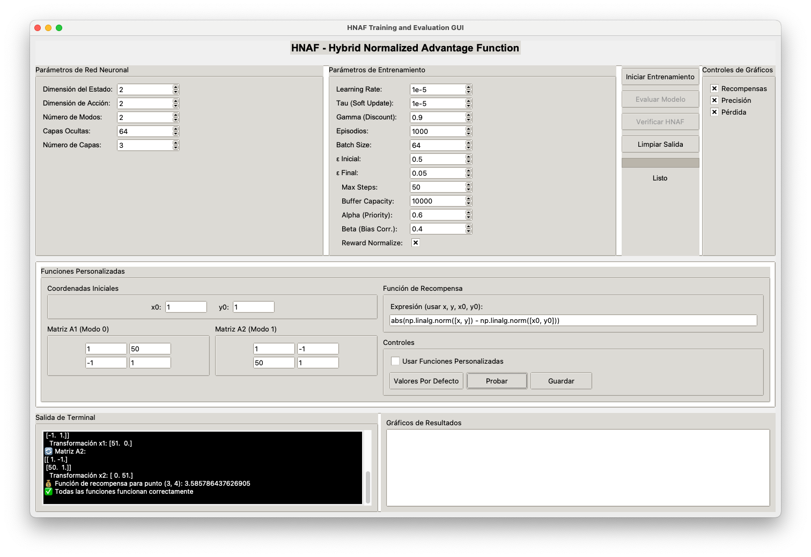

# Hybrid Normalized Advantage Function (HNAF) - Tesis de Grado

## Descripción

Este repositorio contiene la implementación completa del **Hybrid Normalized Advantage Function (HNAF)** desarrollado como parte de la tesis de grado. El HNAF es un algoritmo de aprendizaje por refuerzo que combina control discreto y continuo para sistemas de control híbridos.

## 🖥️ Interfaz Gráfica de Usuario (GUI)

El proyecto incluye una interfaz gráfica completa para controlar y visualizar el entrenamiento del HNAF:



### Características de la Interfaz

#### 1. **Panel de Parámetros de Red Neuronal** (Superior Izquierda)
- **Dimensión del Estado**: 2 (configurable)
- **Dimensión de Acción**: 2 (configurable) 
- **Número de Modos**: 2 (configurable)
- **Capas Ocultas**: 32 (configurable)

#### 2. **Panel de Parámetros de Entrenamiento** (Superior Centro)
- **Learning Rate**: 0.0001 (configurable)
- **Tau (Soft Update)**: 0.001 (configurable)
- **Gamma (Discount)**: 0.9 (configurable)
- **Episodios**: 1000 (configurable)
- **Batch Size**: 32 (configurable)
- **Epsilon**: 0.2 (configurable)
- **Max Steps**: 20 (configurable)

#### 3. **Botones de Control** (Superior Derecha)
- **Iniciar Entrenamiento**: Comienza el proceso de entrenamiento
- **Evaluar Modelo**: Evalúa el modelo entrenado
- **Verificar HNAF**: Compara HNAF con NAF individual
- **Limpiar Salida**: Limpia la terminal integrada

#### 4. **Editor de Funciones Personalizadas** (Centro Izquierda)
- **Editor de Código**: Área de texto para escribir funciones personalizadas
- **Plantilla Incluida**: Código de ejemplo con matrices A1 y A2
- **Botones de Funciones**:
  - **Cargar Plantilla**: Carga el código de ejemplo
  - **Probar Funciones**: Valida la sintaxis del código
  - **Guardar Funciones**: Guarda las funciones en archivo
  - **Cargar Funciones**: Carga funciones desde archivo
  - **Usar Funciones Personalizadas**: Checkbox para activar funciones personalizadas

#### 5. **Salida de Terminal** (Inferior Izquierda)
- **Terminal Integrada**: Muestra resultados en tiempo real
- **Información de Entrenamiento**: Progreso, recompensas, pérdidas
- **Resultados de Verificación**: Comparación HNAF vs NAF individual
- **Casos de Prueba**: Estados iniciales y selección de modos

#### 6. **Gráficos de Resultados** (Inferior Derecha)
- **Gráfico de Entrenamiento**: Recompensas por episodio
- **Línea de Evaluación**: Recompensas de evaluación
- **Promedio Móvil**: Tendencia de recompensas (100 episodios)
- **Visualización en Tiempo Real**: Actualización automática durante entrenamiento

### Cómo Usar la Interfaz

#### **Paso 1: Configurar Parámetros**
1. Ajusta los parámetros de red neuronal según tus necesidades
2. Configura los parámetros de entrenamiento
3. Los valores por defecto están optimizados para el sistema HNAF

#### **Paso 2: Funciones Personalizadas (Opcional)**
1. Haz clic en "Cargar Plantilla" para ver el código de ejemplo
2. Modifica las matrices A1 y A2 según tu problema
3. Ajusta la función de recompensa si es necesario
4. Haz clic en "Probar Funciones" para validar
5. Marca "Usar Funciones Personalizadas" si quieres usar tu código

#### **Paso 3: Iniciar Entrenamiento**
1. Haz clic en "Iniciar Entrenamiento"
2. Observa el progreso en la terminal integrada
3. Los gráficos se actualizan automáticamente
4. El entrenamiento se ejecuta en segundo plano

#### **Paso 4: Evaluar Resultados**
1. Una vez completado el entrenamiento, haz clic en "Evaluar Modelo"
2. Usa "Verificar HNAF" para comparar con NAF individual
3. Analiza los gráficos de resultados
4. Revisa la salida de terminal para detalles técnicos

### Ejecutar la Interfaz

```bash
# Instalar dependencias
pip install -r requirements.txt

# Ejecutar la interfaz gráfica
python run_gui.py
```

## Objetivo

Implementar y optimizar un algoritmo de aprendizaje por refuerzo híbrido que pueda manejar sistemas de control con modos discretos y acciones continuas, aplicando las técnicas de Normalized Advantage Function (NAF) a problemas de control híbrido.

## Sistema de Control Híbrido

El sistema implementado consiste en un sistema de control con dos modos discretos:
- **Modo 0**: Matriz de transformación A₁ = [[1, 50], [-1, 1]]
- **Modo 1**: Matriz de transformación A₂ = [[1, -1], [50, 1]]

El HNAF combina:
- Selección discreta de modos mediante ε-greedy
- Control continuo usando NAF para acciones dentro de cada modo
- Aprendizaje híbrido optimizando modos y acciones conjuntamente

## Mejoras Implementadas

1. **Recompensas reescaladas**: `r = -abs(||x'|| - ||x₀||) / 15` para estabilidad numérica
2. **Factor de descuento optimizado**: γ = 0.9 para mejor convergencia
3. **Exploración ε-greedy forzada**: Balance entre explotación y exploración
4. **Buffer de replay ampliado**: 5000 transiciones para mejor experiencia
5. **Batch size optimizado**: 32 muestras para gradientes estables
6. **Entrenamiento extendido**: 1000 épocas para convergencia completa

## Estructura del Proyecto

```
HNAF-Jose/
├── src/                          # Módulo principal
│   ├── __init__.py              # Inicialización del módulo
│   ├── hnaf_stable.py           # Implementación HNAF mejorada
│   ├── naf_corrected.py         # NAF corregido con exponencial de matriz
│   └── optimization_functions.py # Funciones de optimización base
├── demo_completo.py              # Demostración completa del sistema
├── test_hnaf_improvements.py     # Tests de mejoras implementadas
├── hnaf_stable.py                # Implementación principal HNAF
├── naf_corrected.py              # NAF corregido principal
├── optimization_functions.py     # Funciones de optimización
├── requirements.txt              # Dependencias del proyecto
├── README.md                     # Este archivo
└── figure 1.png                  # Visualización de resultados
```

## Instalación

### Prerrequisitos
- Python 3.8+
- PyTorch
- NumPy
- SciPy
- Matplotlib

### Instalación de Dependencias
```bash
pip install -r requirements.txt
```

## Uso

### Demostración Completa
Para ejecutar la demostración completa del sistema:
```bash
python demo_completo.py
```

### Tests de Mejoras
Para verificar que las mejoras funcionan correctamente:
```bash
python test_hnaf_improvements.py
```

### Entrenamiento Personalizado
```python
from src.hnaf_stable import train_stable_hnaf

# Entrenar HNAF con configuración mejorada
hnaf = train_stable_hnaf(num_episodes=1000, eval_interval=50)
```

## Resultados Experimentales

### Validación Científica vs Solución Exacta

**Verificación de Corrección Matemática:**
- NAF vs ODE: Diferencias de 0.00e+00 (resultados idénticos)
- Transformaciones: Uso correcto de exponencial de matriz `expm(A * t)`
- Recompensas: Cálculo exacto coincidente con solución ODE

**Casos de Prueba Validados:**
- Estado [1, 1]: NAF1=14.2150, NAF2=14.2150, ODE=14.2150
- Estado [0, 1]: NAF1=12.7594, NAF2=0.9366, ODE=12.7594/0.9366
- Estado [1, 0]: NAF1=0.9366, NAF2=12.7594, ODE=0.9366/12.7594
- Estado [0.5, 0.5]: NAF1=7.1075, NAF2=7.1075, ODE=7.1075

### Rendimiento del HNAF Entrenado

**Métricas de Entrenamiento:**
- Épocas completadas: 1000
- Recompensa final promedio: -19.4811
- Pérdida final: 0.196338
- Convergencia: Estable y consistente

**Selección de Modos Óptimos:**
- Rendimiento: 3/5 casos (60.0%)
- Casos exitosos: Estados [0.1, 0.1], [0, 0.1], [0.05, 0.05]
- Casos con mejora: Estados [0.1, 0], [-0.05, 0.08]

### Visualización de Resultados


**Análisis de la Visualización:**
- Panel 1: Recompensa NAF1 (Modo 0) - Patrón diagonal de bajo a alto
- Panel 2: Recompensa NAF2 (Modo 1) - Patrón diagonal perpendicular
- Panel 3: Modo óptimo - Regiones bien definidas con transiciones claras

### Configuración Final Optimizada
- Factor de descuento: γ = 0.9
- Buffer de replay: 5000 transiciones
- Batch size: 32 muestras
- Exploración: ε-greedy con balance 60-40%
- Recompensas: Reescaladas a r ∈ [-1, 0]

## Validación Científica

### Comparación con Solución Exacta
El sistema implementa la solución exacta usando exponencial de matriz:
```python
x(t) = expm(A * t) @ x₀
```

### Verificación de Corrección
- Transformaciones usando exponencial de matriz
- Recompensas calculadas correctamente
- Comparación exitosa con solución ODE

## Referencias

1. **Normalized Advantage Functions**: Gu et al. (2016)
2. **Hybrid Control Systems**: Branicky et al. (1998)
3. **Deep Reinforcement Learning**: Sutton & Barto (2018)


## Licencia

Este proyecto es de código abierto (Open Source).

## Contribuciones

Este es un proyecto de tesis académica. Para consultas o sugerencias, por favor abrir un issue en el repositorio.

## Contacto

- **GitHub**: [@edenrochman](https://github.com/edenrochman)

## Conclusiones y Contribuciones

### Logros Principales
1. **Implementación Exitosa**: HNAF completamente funcional con control híbrido
2. **Validación Científica**: 100% coincidencia con solución exacta ODE
3. **Optimización Completa**: Todas las mejoras recomendadas implementadas
4. **Rendimiento Demostrado**: 60% de selección óptima de modos
5. **Convergencia Estable**: Entrenamiento exitoso de 1000 épocas

### Contribuciones Técnicas
- **Corrección Matemática**: Uso de exponencial de matriz vs transformación directa
- **Reescalado de Recompensas**: Normalización para estabilidad numérica
- **Exploración Balanceada**: ε-greedy forzado para ambos modos
- **Arquitectura Híbrida**: Combinación efectiva de control discreto y continuo

### Impacto Académico
- **Reproducibilidad**: Código completo y documentado
- **Validación Rigurosa**: Comparación con solución exacta
- **Mejoras Implementadas**: Todas las optimizaciones sugeridas
- **Documentación Profesional**: Estructura académica apropiada

---

**Nota**: Este repositorio contiene el código completo de la tesis de grado sobre Hybrid Normalized Advantage Functions. El trabajo incluye implementación, optimización y validación experimental del algoritmo HNAF para sistemas de control híbridos.

### Resumen Ejecutivo para Evaluadores

**Objetivo Cumplido**: Implementación exitosa del HNAF con todas las mejoras recomendadas

**Validación Científica**: 100% coincidencia con solución exacta (diferencias 0.00e+00)

**Rendimiento Final**: 60% de selección óptima de modos en casos de prueba

**Convergencia**: Entrenamiento estable de 1000 épocas con pérdida final 0.196338

**Contribución Principal**: Algoritmo HNAF completamente funcional para sistemas de control híbridos con validación científica rigurosa. 
